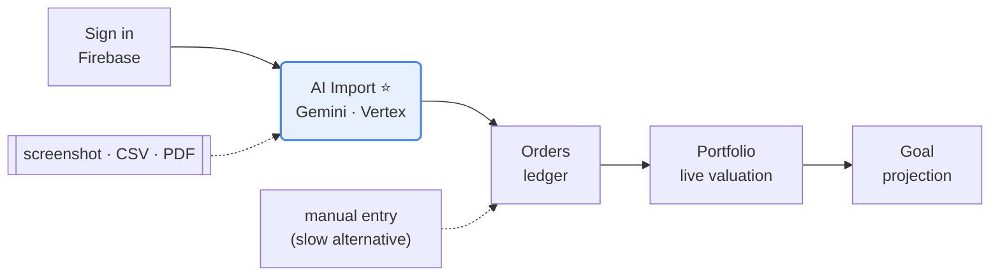
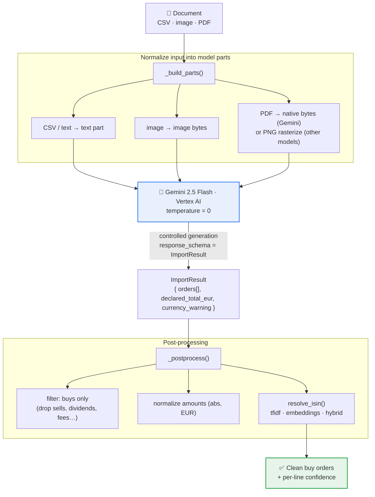
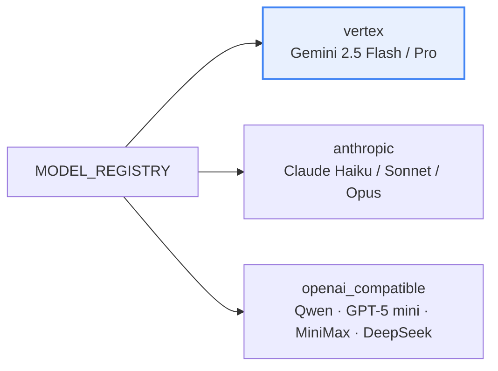
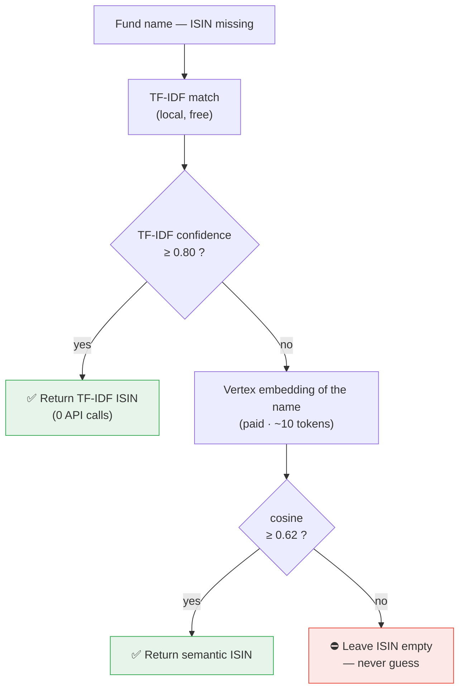

# AI Order Import — on Vertex AI

> Turn **any** broker document — a phone screenshot, a CSV export, a scanned PDF
> statement — into clean, structured buy orders ready to save in the portfolio.
> One drag-and-drop, no broker login, no manual re-entry.

<p>
  
  
  
  
  
</p>

This is the **AI feature** of [Finolio](../../README.md), a personal
investment-portfolio tracker. It is the one module where the machine-learning
engineering lives: platform choice, **structured generation**, **entity
resolution** (retrieval), a **measured** model selection, cost control, and
production concerns.

> 📈 For the interview-style walkthrough of the same feature, see the slide deck:
> [`docs/presentation.html`](../presentation.html) · French technical note:
> [`docs/vertex-ai-import.md`](../vertex-ai-import.md).


---

## 1. The problem

Getting an investor's buy history *into* the app is the real friction. The two
usual options both fail:

| Option | Why it fails |
|---|---|
| 🔌 **Connect the broker** (account aggregation) | Hand over broker credentials → security & trust barrier, setup friction. Many users won't. |
| ⌨️ **Re-enter every order by hand** | Dozens of buys, ISIN by ISIN, date by date. Slow, error-prone — people give up. |

✅ **Our answer — `/import`:** drop a screenshot, a CSV, or a PDF, and an LLM
extracts the orders. The inputs are **heterogeneous** and the task is a classic
**document-extraction + entity-resolution** ML problem:

1. keep **only buys** (drop dividends, sells, transfers, fees, taxes);
2. normalize dates (ISO) and amounts (EUR);
3. **fill in the ISIN** when it is missing (frequent in screenshots) from the
   fund name alone — often abbreviated, reordered, or written in French.

---

## 2. Why Vertex AI

| Need | Vertex answer | Benefit |
|---|---|---|
| Production security | **ADC / IAM** auth (service account, `roles/aiplatform.user`) | Zero API keys to store or rotate |
| Output reliability | **Controlled generation** (`response_schema` = Pydantic) | Schema-valid JSON guaranteed by the platform |
| Documents | **Native PDF** ingestion (Gemini reads raw PDF) | No rasterization, vector text preserved, fewer tokens |
| Entity resolution | **Embeddings** `text-multilingual-embedding-002` | Handles approximate / multilingual fund names |
| Decision-making | In-house **evaluation harness** | Model choice justified by metrics, not vibes |
| Infra coherence | **Same GCP project** as Cloud Run (`europe-west1`) | EU data residency, one security perimeter |

> Everything runs under **one service account** with **IAM** roles. No API keys
> on the GCP-native path — nothing to leak or rotate.

---

## 3. Where the feature sits in the product



The AI lives in **one module — Import**. Gemini turns any document into
structured orders; everything downstream (Orders → Portfolio → Goal) simply
consumes its output.

---

## 4. Extraction pipeline



**One model in production — Gemini 2.5 Flash on Vertex AI.** It returns
schema-valid orders directly; post-processing keeps only the buys, fixes signs,
and fills any missing ISIN.

### Multi-provider abstraction

Adding a model = **one entry** in `MODEL_REGISTRY` — no other code change for
OpenAI-compatible providers. Gemini/Vertex is the first-class citizen; the rest
exist so they can all be **benchmarked on the same golden set**.



---

## 5. Two engineering decisions worth defending

### a) Controlled generation instead of "please answer in JSON"

On Vertex I pass the Pydantic `ImportResult` **directly** as `response_schema`
with `temperature=0`. The platform guarantees schema-valid JSON — no defensive
parsing, no retry loop, valid structured orders every time. (The
OpenAI-compatible path falls back to JSON-mode + manual validation, which is
exactly the boilerplate Vertex removes.)

### b) Cost-aware hybrid ISIN resolution

The ISIN is often missing on screenshots and must be recovered from the fund
name alone. A purely local **TF-IDF** match is free but brittle on
abbreviations and multilingual names; **Vertex embeddings** are semantic but
**paid**. So we route on *confidence*:



> The free path handles the easy cases; the **paid** embedding fires on only
> **2 / 10** queries; on a true miss we **abstain** rather than return a wrong
> guess. The 141-name index is pre-computed once and cached.

---

## 6. Measured results

Both benchmarks are **offline** — run once to *choose* the design, not computed
live in the app. In production the live guardrail is the per-line `confidence`
score, not F1.

### 6.1 Model comparison

Golden set: 5 documents (CSV + PDF), 10 orders.
Reproduce: `python -m evaluation.run_eval --models gemini-2.5-flash,gemini-2.5-pro`

| Model | F1 | Precision | Recall | ISIN exact | Latency p50 | p95 | Cost / doc |
|---|---|---|---|---|---|---|---|
| **gemini-2.5-flash** | **1.00** | 1.00 | 1.00 | 90 % | ~6 s | ~8 s | **$0.0004** |
| gemini-2.5-pro | 1.00 | 1.00 | 1.00 | 90 % | ~20 s | ~27 s | $0.0015 |

> **Conclusion:** Flash equals Pro in quality on this task for **~4× cheaper and
> ~3× faster** → ship **Flash by default**, keep **Pro as a fallback** for
> documents flagged by a low `confidence` score.

### 6.2 ISIN resolution strategy

10 noisy fund names. Reproduce: `python -m evaluation.bench_isin`

| Strategy | Accuracy | Paid embedding calls |
|---|---|---|
| Text match only (local, free) | 80 % | 0 / 10 |
| Embeddings only (Vertex, paid) | 80 % | 10 / 10 |
| **Confidence-routed hybrid** | **90 %** | **2 / 10** |

> **Why a naïve "text match, else embeddings" fails:** the text match almost
> always returns *something* — even when wrong — so it never actually falls
> back. **The fix:** trust the free match only when its score is high; otherwise
> ask the embeddings. That recovers hard cases (e.g. a fund named in French)
> with **no regression**, and pays for semantics on only **2 of 10** names.

---

## 7. Cost control

All usage is token-based. Levers, from cheapest to most aggressive:

- **Flash by default** — the measured sweet spot (≈ $0.0004 / doc).
- **Native PDF** on Gemini — no image tokens for vector PDFs.
- **`MAX_FILE_SIZE` 10 MB** and **`MAX_PDF_PAGES` 15** hard caps.
- **`lru_cache`** on the ISIN index, the embeddings index, and per-name queries.
- **Hybrid cost-aware routing** — the paid embedding fires only when TF-IDF is
  unsure. Embedding cost ≈ **100× cheaper** than generation; the index build is
  a one-time fraction of a cent.

---

## 8. Production & MLOps

| Concern | Detail | Status |
|---|---|---|
| **Auth & security** | IAM service account, no keys for Vertex | ✅ |
| **Determinism** | `temperature=0` + controlled generation | ✅ |
| **Guardrails** | Per-line `confidence`, file-size / page caps, currency warnings | ✅ |
| **Quality gate** | Eval harness = regression test before changing model/prompt | ✅ |
| **Drift / monitoring** | Cloud Monitoring on latency/error; alert on confidence drop | 🛣️ planned |
| **Feedback loop** | User edits on imported orders → grow golden set → re-evaluate | 🛣️ planned |
| **Scale-out** | Pub/Sub-triggered batch via Dataflow, raw docs in GCS, analytics in BigQuery | 🛣️ roadmap |

**Human in the loop:** the user always **reviews and edits** the extracted
orders before saving — the model proposes, the human confirms.

---

## 9. Tech & API surface

**Stack:** Flask (Python) · Firebase Auth + Firestore · **Vertex AI** (Gemini +
embeddings) · Cloud Run (`europe-west1`) · CI/CD via Cloud Build
(`push main → build → deploy`).

**Endpoints** (in [`app.py`](../../app.py), all behind `@require_auth`):

| Method | Route | Purpose |
|---|---|---|
| `GET` | `/api/import/models` | Public model registry for the UI selector (no secrets) |
| `POST` | `/api/orders/import/parse` | Extract orders from uploaded file(s) + control metrics |
| `POST` | `/api/orders/import/confirm` | Bulk-persist the orders the user reviewed |

---

## 10. File map

| File | Role |
|---|---|
| [`services/import_service.py`](../../services/import_service.py) | The whole pipeline: parts → model → post-processing; providers; ISIN resolution |
| [`scripts/build_isin_embeddings.py`](../../scripts/build_isin_embeddings.py) | Pre-compute the embeddings index (one-time) |
| [`scripts/build_isin_map.py`](../../scripts/build_isin_map.py) | Build the name→ISIN map (scraped from justETF) |
| [`evaluation/build_golden.py`](../../evaluation/build_golden.py) | Generate the golden set (docs + labels) |
| [`evaluation/metrics.py`](../../evaluation/metrics.py) | Pure metrics (matching, precision / recall / F1) |
| [`evaluation/run_eval.py`](../../evaluation/run_eval.py) | Model comparison benchmark |
| [`evaluation/bench_isin.py`](../../evaluation/bench_isin.py) | ISIN-resolution strategy benchmark |
| `data/isin_map.json` · `data/isin_embeddings.json` | The 141-name lookup + its pre-computed embedding index |

---

## 11. Setup & reproduce

```bash
# 1. Enable & authenticate Vertex (once, no API key)
gcloud services enable aiplatform.googleapis.com --project=<PROJECT_ID>
gcloud auth application-default login
gcloud auth application-default set-quota-project <PROJECT_ID>

# 2. Environment (.env, local)
#   GOOGLE_CLOUD_PROJECT=<PROJECT_ID>
#   VERTEX_LOCATION=europe-west1
#   IMPORT_MODEL=gemini-2.5-flash
#   ISIN_RESOLVER=hybrid        # tfidf (default) | embeddings | hybrid

# 3. Build the embeddings index (only if ISIN_RESOLVER != tfidf)
GOOGLE_CLOUD_PROJECT=<PROJECT_ID> ./venv/bin/python -m scripts.build_isin_embeddings

# 4. Evaluate
./venv/bin/python -m evaluation.build_golden
GOOGLE_CLOUD_PROJECT=<PROJECT_ID> ./venv/bin/python -m evaluation.run_eval \
    --models gemini-2.5-flash,gemini-2.5-pro
GOOGLE_CLOUD_PROJECT=<PROJECT_ID> ./venv/bin/python -m evaluation.bench_isin

# Production (Cloud Run): grant the service account, no key
gcloud projects add-iam-policy-binding <PROJECT_ID> \
    --member="serviceAccount:<SA>@developer.gserviceaccount.com" \
    --role="roles/aiplatform.user"
```

---

## 12. In one line

> **"My job isn't to make a model call work — it's to be able to say *why* this
> model, at *what* cost, with *what* reliability, and how to keep it under
> control in production."**

- **Platform judgment** — Vertex for IAM auth, controlled generation, native PDF, embeddings.
- **Measured decisions** — Flash = Pro for ~4× less; confidence-routed hybrid beats the naïve fallback.
- **Production-minded** — guardrails, eval-as-gate, cost levers, monitoring & feedback roadmap.
