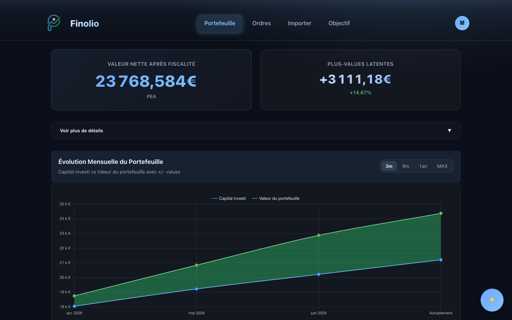
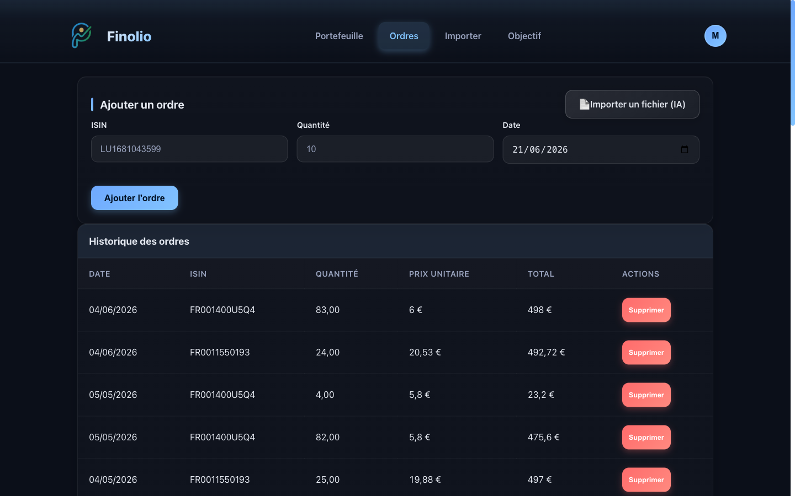
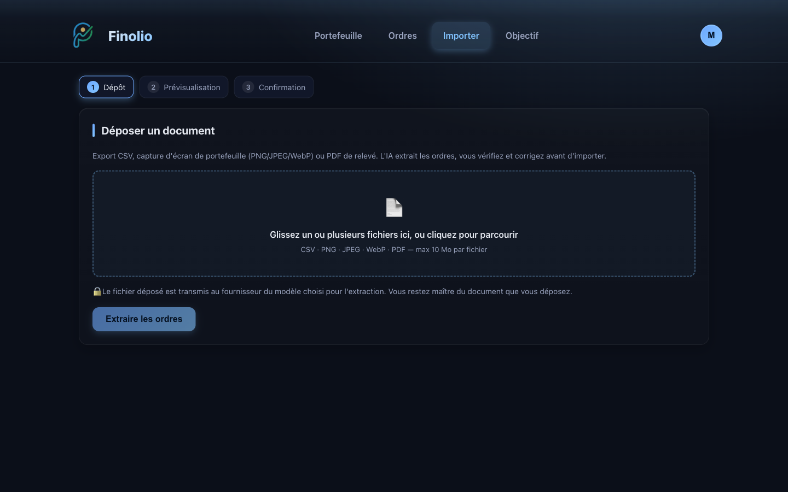
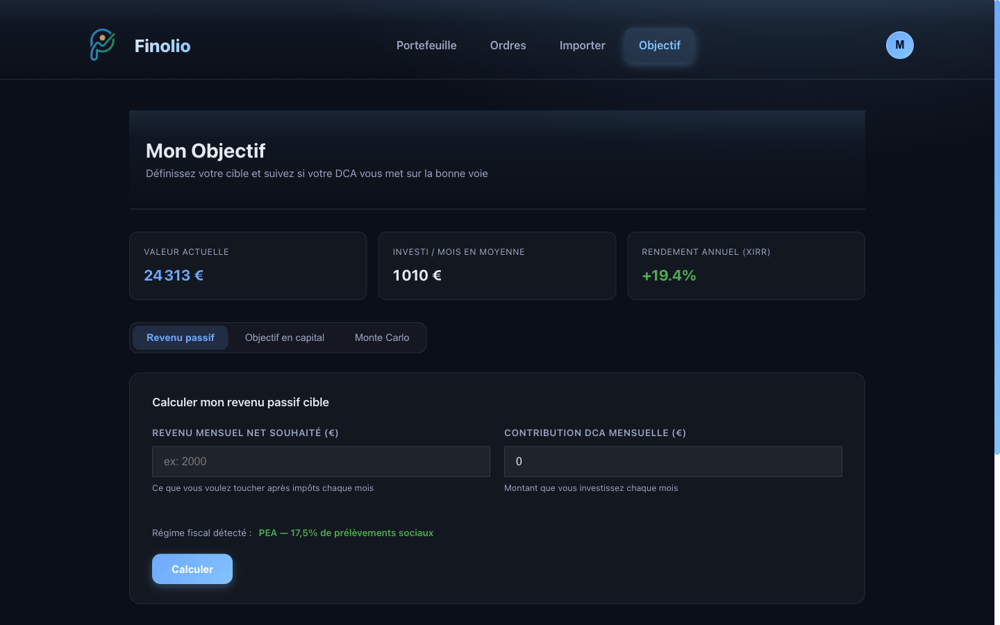

# Finolio — AI Order Import on Vertex AI

> Interview deck — **Vertex AI Developer (Consultant), Deloitte ADMX**
> Candidate: Martin de Combarieu · Live app on Google Cloud Run (`europe-west1`)

This deck first presents the **product** and its modules, then zooms in on one
feature — **AI-powered order import on Vertex AI** — to show end-to-end ML
engineering judgment: platform choice, structured generation, retrieval,
**measured** model selection, cost control, and production concerns.

---

## 1. The product in one line

**Finolio** is a personal investment-portfolio tracker: you record your
buys, it values your positions live, projects your wealth and passive income,
and lets you import your broker history with a single drag-and-drop — parsed by
an LLM on Vertex AI.



- **Live in production** on Google Cloud Run, CI/CD via Cloud Build (`push main → build → deploy`).
- **Stack**: Flask (Python) · Firebase Auth + Firestore · Stripe (freemium) · **Vertex AI** (Gemini + embeddings).
- **Single GCP project** (`suivi-finance-472610`, `europe-west1`) → EU data residency, one security perimeter.

---

## 2. Modules & user journey

```
  1 Sign in ──► 2 AI Import ⭐ ──► 3 Orders ──► 4 Portfolio ──► 5 Goal
   (Firebase)   (Gemini·Vertex)    (ledger)     (valuation)    (projection)
                      ▲
        screenshot · CSV · PDF      ⤷ alternative to step 2: add orders by hand (slow)
```

- **Where the AI lives — one module, Import.** Gemini on Vertex AI turns any
  document into structured orders; everything downstream (Orders → Portfolio →
  Goal) consumes its output.
- **Cross-cutting:** Auth (Firebase) everywhere · Subscription (Stripe freemium)
  gates premium · per-line `/position/<isin>` drill-down.

> The AI Import module is the focus of this deck — it is where the Vertex AI
> engineering lives.

---

## 2b. Four screens

| | |
|---|---|
|  |  |
| **Portfolio** — live net value & monthly evolution | **Orders** — ledger + "Import a file (AI)" |
|  |  |
| **AI Import** — drop a doc, pick a model | **Goal** — passive income & projection |

---

## 3. System architecture (product)

```
        Browser (Jinja templates + JS)
                  │ HTTPS
                  ▼
        Flask app  (app.py, ~30 routes)
        ├── Firebase Auth ── identity
        ├── Firestore     ── orders / portfolio / goals
        ├── Stripe        ── freemium billing + webhooks
        └── services/import_service.py ── Vertex AI pipeline
                  │
                  ▼
   Google Cloud Run  (container, europe-west1)
   built & deployed by Cloud Build on push to main
```

Everything runs under **one service account** with **IAM** roles — including
`roles/aiplatform.user` for Vertex. No API keys for the GCP-native path.

---

## 3c. The problem (AI Import)

Getting an investor's buy history *into* the app is the real friction — and the
two usual options both fail:

- ✕ **Connect the broker** — account aggregation means handing over broker
  credentials: a security & trust barrier, plus setup friction. Many users won't.
- ✕ **Re-enter every order by hand** — dozens of buys, ISIN by ISIN, date by date.
  Slow and error-prone; people give up.

> ✅ **Solution — `/import`**: drop a **screenshot** of your broker history — or a
> **CSV** exported from your own Google Sheet — and the AI extracts your orders.
> No broker login, no manual entry.

---

## 4. Zoom: the extraction challenge (AI Import)

Once the user sends a document, the inputs are **heterogeneous**:

- a clean **CSV** export,
- a **screenshot** of a mobile app,
- a **scanned PDF** statement.

We must:

1. keep **only buys** (drop dividends, sells, transfers, fees, taxes);
2. normalize dates and amounts (EUR);
3. **fill in the ISIN** when it's missing (frequent in screenshots) from the
   fund name alone — often abbreviated, reordered, or in French.

This is a classic **document-extraction + entity-resolution** ML problem.

---

## 5. Why Vertex AI

| Need | Vertex answer | Benefit |
|---|---|---|
| Prod security | **ADC / IAM** auth (service account, `roles/aiplatform.user`) | Zero API keys to store / rotate |
| Output reliability | **Controlled generation** (`response_schema` = Pydantic) | Schema-valid JSON guaranteed by the platform |
| Documents | **Native PDF** (Gemini ingests raw PDF) | No rasterization, vector text preserved, fewer tokens |
| Entity resolution | **Embeddings** `text-multilingual-embedding-002` | Handles approximate / multilingual names |
| Decision-making | In-house **evaluation harness** | Model choice justified by metrics, not vibes |
| Infra coherence | **Same GCP project** as Cloud Run | EU data residency, one perimeter |

---

## 5b. The feature, in the product


- Three guided steps: **Drop → Preview → Confirm**.
- Powered by **Gemini on Vertex AI** — nothing to configure, no keys for the user.
- Accepts **CSV · PNG / JPEG / WebP · PDF**, ≤ 10 MB per file, multi-file.
- Human in the loop: the user **reviews & edits** extracted orders before saving.

---

## 6. Pipeline architecture (AI Import)

```
   Document  ──►  _build_parts()
  (CSV/IMG/PDF)    • CSV/text → text part
                   • image    → image bytes
                   • PDF      → native bytes (Gemini)  or  PNG rasterize (others)
                        │
                        ▼
         Gemini 2.5 Flash  (Vertex AI · temperature 0)
         • reads text, images & native PDF
                        │  controlled generation (response_schema = ImportResult)
                        ▼
         ImportResult { orders[], declared_total_eur, currency_warning }
                        │
                        ▼
         _postprocess()
         • filter: buys only
         • ISIN resolution: resolve_isin()  →  tfidf | embeddings | hybrid (cost-aware)
```

**One model in production — Gemini 2.5 Flash on Vertex AI.** It returns schema-valid
orders directly; post-processing keeps only the buys and fills any missing ISIN.

---

## 7. Two engineering decisions worth defending

**a) Controlled generation instead of "please answer in JSON".**
On Vertex I pass the Pydantic `ImportResult` directly as `response_schema` with
`temperature=0`. The platform guarantees schema-valid JSON — no defensive
parsing, no retry loop — valid, structured orders every time.

**b) Cost-aware hybrid ISIN resolution.**
TF-IDF (local, free) runs first; the **paid** Vertex embedding is called **only**
when TF-IDF's confidence is below a threshold. The 141-name index is
pre-computed once and cached. We pay for semantics only on the hard cases.

---

## 8. Measurement — model comparison

**Offline benchmark** on a labelled golden set (5 docs, 10 orders) — run once to
**choose the model**, not computed live in the app. Reproducible:
`python -m evaluation.run_eval --models gemini-2.5-flash,gemini-2.5-pro`

| Model | F1 | Precision | Recall | ISIN exact | Latency p50 | p95 | Cost/doc (est.) |
|---|---|---|---|---|---|---|---|
| **gemini-2.5-flash** | 1.00 | 1.00 | 1.00 | 90 % | ~6 s | ~8 s | **$0.0004** |
| gemini-2.5-pro | 1.00 | 1.00 | 1.00 | 90 % | ~20 s | ~27 s | $0.0015 |

> **Conclusion:** Flash equals Pro in quality on this task, for **~4× cheaper and
> ~3× faster** → ship **Flash by default**, keep **Pro as a fallback** for
> documents flagged by a low `confidence` score.

These metrics live in the **evaluation harness (offline)** to justify the model
choice. In production the live guardrail is the per-line `confidence` score — not F1.

---

## 8b. Hybrid ISIN routing (cost-aware)

```
   Fund name — ISIN missing
            │
            ▼
   TF-IDF match  (local, free)
            │
            ▼
   ┌─ TF-IDF confidence ≥ 0.80 ? ─ yes ─►  Return TF-IDF ISIN  (0 API call)
   │
   no
   ▼
   Vertex embedding of the name  (paid · ~10 tokens)
            │
            ▼
   ┌─ cosine ≥ 0.62 ? ─ yes ─►  Return semantic ISIN
   │
   no
   ▼
   Leave ISIN empty — never guess
```

> Free path on the easy cases; the **paid** embedding fires on only **2/10**
> queries; safe abstain rather than a wrong guess.

---

## 9. Measurement — ISIN resolution strategy

**Offline benchmark**: 10 noisy fund names. Reproducible: `python -m evaluation.bench_isin`

| Strategy | Accuracy | Paid embedding calls |
|---|---|---|
| Text match only (local, free) | 80 % | 0 / 10 |
| Embeddings only (Vertex, paid) | 80 % | 10 / 10 |
| **Confidence-routed hybrid** | **90 %** | **2 / 10** |

> **Why a simple "text match, else embeddings" fails:** the text match almost
> always returns *something* — even when it's wrong — so it never actually falls back.
>
> **The fix — fall back on confidence:** trust the free text match only when its
> score is high; otherwise ask the Vertex embeddings. That recovers hard cases
> (e.g. a fund named in French) with **no regression**, and the paid call fires on
> only **2 of 10** names.

---

## 10. Cost & model pricing

All usage-based (tokens). The candidates I benchmarked before choosing — price ($ / 1M tokens):

| Model | In | Out | Multimodal | Role |
|---|---|---|---|---|
| Gemini 2.5 Flash | 0.30 | 2.50 | ✅ + native PDF | **default** |
| Gemini 2.5 Pro | 1.25 | 10.0 | ✅ + native PDF | accuracy fallback |
| Qwen3-VL-Plus | 0.30 | 1.20 | ✅ | doc/OCR specialist (benchmark) |
| GPT-5 mini | 0.25 | 2.00 | ✅ | benchmark |
| MiniMax M3 | 0.60 | 2.30 | ✅ | 1M context (benchmark) |
| Claude Haiku/Sonnet/Opus | 1–5 | 5–25 | ✅ | benchmark / hard docs |
| DeepSeek V4 | 0.14 | 0.28 | ❌ text only | cheapest, CSV-only |

**Cost control levers:** Flash default · `MAX_FILE_SIZE` 10 MB · `MAX_PDF_PAGES`
15 · `lru_cache` on index + queries · similarity thresholds · **hybrid cost-aware**
(embedding only when TF-IDF is unsure). Embedding cost ≈ **100× cheaper** than
generation; the index is a one-time fraction of a cent.

---

## 11. Production & MLOps concerns

| Concern | Implemented / planned |
|---|---|
| **Auth & security** | IAM service account, no keys for Vertex (✅) |
| **Determinism** | `temperature=0`, controlled generation (✅) |
| **Guardrails** | Per-line `confidence`, file-size / page caps, currency warnings (✅) |
| **Quality gate** | Eval harness = regression test before changing model/prompt (✅) |
| **Drift / monitoring** | Cloud Monitoring on latency/error; alert on confidence drop (planned) |
| **Retraining loop** | User corrections → re-feed golden set → re-evaluate (planned) |
| **Scale-out** | Batch via Dataflow, store via Cloud Storage / BigQuery (roadmap) |

---

## 12. Mapping to the job description

| JD responsibility | What this project demonstrates |
|---|---|
| Design/deploy ML pipelines on Vertex AI | Gemini pipeline on Vertex AI, in prod on Cloud Run |
| End-to-end ML workflow (ingest → deploy → monitor) | File ingest → controlled generation → post-process → eval → guardrails |
| Translate requirements into scalable Vertex solutions | Product-driven feature, shipped on Vertex |
| Vertex Model Registry / Feature Store mindset | Versioned eval golden set + pre-computed embeddings index |
| Integrate GCP services (BigQuery, GCS, Pub/Sub, Dataflow) | Roadmap: batch + storage + analytics (positioned, not faked) |
| Monitor drift, configure alerts, retrain | Confidence routing + eval-as-gate + feedback loop |
| Documentation & knowledge sharing | This deck + `docs/vertex-ai-import.md` + reproducible evals |

---

## 13. Roadmap / next steps

1. **Share-class re-ranking** for ISIN (acc vs dist) on semantic candidates.
2. **Feedback loop**: capture user edits on imported orders → grow golden set → CI re-eval.
3. **Monitoring**: Cloud Monitoring dashboards (latency, error rate, mean confidence) + alerts.
4. **Scale**: Pub/Sub-triggered batch import via Dataflow; archive raw docs in Cloud Storage; analytics in BigQuery.
5. **Vertex AI Pipelines** to formalize ingest → extract → resolve → evaluate as a managed DAG.

---

## 14. Closing

> **"My job isn't to make a model call work — it's to be able to say *why* this
> model, at *what* cost, with *what* reliability, and how to keep it under
> control in production."**

- Platform judgment: Vertex for IAM auth, controlled generation, native PDF, embeddings.
- **Measured** decisions: Flash = Pro for 4× less; confidence-routed hybrid beats naïve.
- Production-minded: guardrails, eval-as-gate, cost levers, monitoring & feedback roadmap.

**Thank you — questions welcome.**
